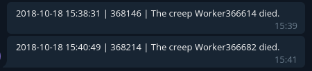

# screeps-notifications
Notify yourself via telegram in screeps

## Usage
- Run the `index.js` (after installation)
- Add the `notifications.js` into your codebase.
- Require it.
- And call the `add()` function to add a notification

### Example
main.js
```js
const Notifications = require('notifications')

module.exports.loop = () => {

  for (let name in Memory.creeps) {
    if (!Game.creeps[name]) {
      delete Memory.creeps[name]
      console.log('Clearing non-existing creep memory:', name)
      Notifications.add(`The creep ${name} died.`)
    }
  }

}
```


## Installation
- Download / clone this repo
  ```sh
  git clone https://github.com/marceltransier/screeps-notifications.git
  ```
- Install [NodeJS](https://nodejs.org/en/download/package-manager/) if you haven't already
- Install the dependencies
  ```
  npm i
  ```
- Create a [Telegram bot](https://core.telegram.org/bots)
- Generate a [screeps auth token](https://docs.screeps.com/auth-tokens.html) with the permission to use the `GET /api/user/memory` endpoint
- rename the `config.json.example` file to `config.json`
  ```
  mv config.json.example config.json
  ```
- Fill the `config.json` with
  - the shard you're playing on
  - your screeps token
  - your telegram bot token
  - and your chatid
    - You can get the chatid by starting a chat with the bot (the start button) and fetching the updates from the bot (`curl https://api.telegram.org/botYOURTOKEN/getUpdates`)
- After that, you can start the bot by running `node index.js` or `npm start`
  - The script will fetch every minute the notifications from screeps and send it as telegram message to the configured chat
 

 ## License
This project is licensed under the MIT License - see the [LICENSE](LICENSE) file for details
